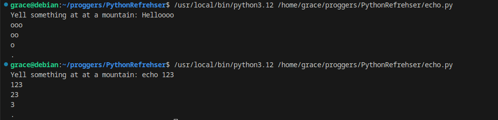
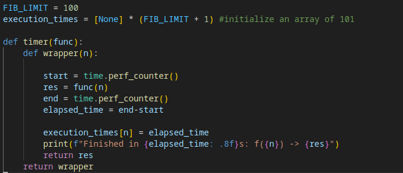
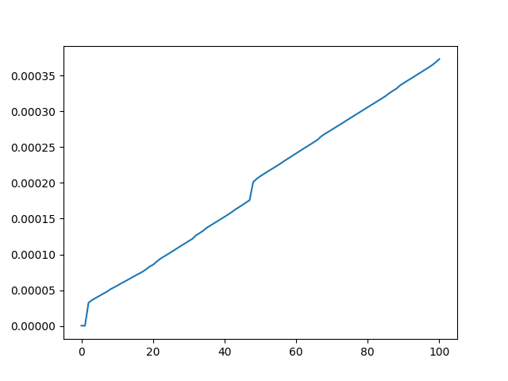

# PythonRefresher

This repository contains two python scripts for the first homework for CS:3980

## 1. Python Programming Basics -- Echo
echo.py implements a function that imitate a real-world echo. The function takes an input, and then returns a string with the last 3,2 and then 1 characters of the input repeated. This imitates an echo effect.

## 2. Python Decorator Implementation -- Fib
fib.py implements a *timer* decorator and the *lru_cache* decorator to wrap around a simple recursive fibonacci function.

The *timer* decorator records the start and end times of the execution of the fibonacci function and save them in a global variable, *execution_times*, which a list that contains the execution times for each fibonacci number. As lru_cache stores each computed fibonacci number, each calculation is performed only once. As a result, each fibonacci number has only one corresponding execution time. 

The execution times is then used to create a graph where x-axis represents the n in Fibonacci number calculation, and y-axis represents the time in seconds.

The increase in execution time is fairly steady, with one noticeable spike in the beginning and in the middle around 45. The spike in the middle is likely due to the system briefly shifting CPU resource away rather than any innate mathematical property of the fibonacci formula.
